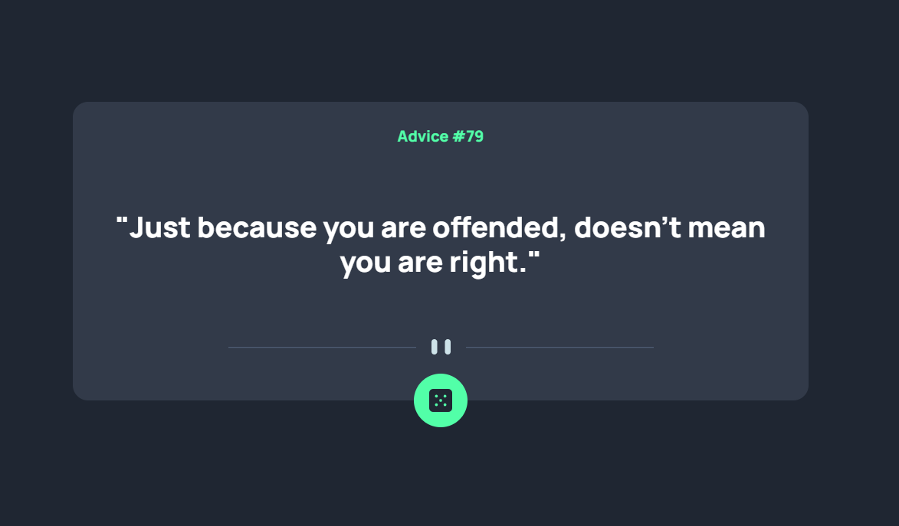

# Frontend Mentor - Advice generator app solution

This is a solution to the [Advice generator app challenge on Frontend Mentor](https://www.frontendmentor.io/challenges/advice-generator-app-QdUG-13db). Frontend Mentor challenges help you improve your coding skills by building realistic projects.

## Table of contents

- [Overview](#overview)
  - [The challenge](#the-challenge)
  - [Screenshot](#screenshot)
  - [Links](#links)
- [My process](#my-process)
  - [Built with](#built-with)
  - [What I learned](#what-i-learned)
- [Author](#author)

## Overview

### The challenge

Users should be able to:

- See advice when opening app
- Click button to generate new advice

### Screenshot

### Links

- Solution URL: [Add solution URL here](https://your-solution-url.com)
- Live Site URL: [Add live site URL here](https://your-live-site-url.com)

## My process

### Built with

- Tailwind CSS
- Flexbox
- REST api
- Vanilla JS

### What I learned

More practise using Tailwind css and images with source set.

## Author

- Frontend Mentor - [@ozamorowski](https://www.frontendmentor.io/profile/ozamorowski)
- Twitter - [@ozamorowski](https://www.twitter.com/ozamorowski)
